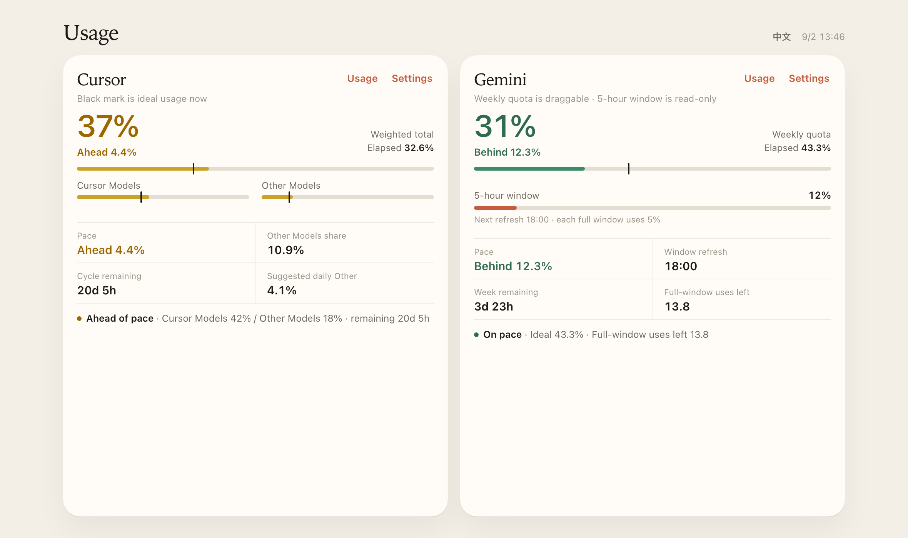

# Usage Sync

**Chrome extension + local HTML dashboards for Cursor & Gemini usage tracking**

**Chrome 扩展 + 本地用量管家：Cursor & Gemini 用量同步与可视化**

[English](#english) · [中文](#中文) · [Rules](docs/RULES.md) · [Changelog](CHANGELOG.md) · [License](LICENSE)



---

## English

### What is Usage Sync?

A **local usage tracking** toolkit with two parts:

| Component | Purpose |
|-----------|---------|
| **Chrome extension** (`extension/`) | Scrapes usage % from Cursor / Gemini official pages into browser storage |
| **Local manager pages** (`managers/`) | Progress bars, ideal usage lines, over-limit warnings; manual slider adjustment |

Personal usage visualization for **Cursor** and **Gemini**.

### Repository structure

```
usage-sync/
├── extension/              # Chrome extension (Manifest V3)
│   ├── content/
│   │   ├── cursor.js         # Scrape Cursor Spending / Billing
│   │   ├── gemini.js         # Scrape Gemini Usage
│   │   └── manager-bridge.js # Sync to local HTML managers
│   ├── popup/
│   └── manifest.json
├── managers/
│   ├── index.html                  # Combined dashboard (Cursor + Gemini)
│   ├── cursor-usage-manager.html   # Cursor-only page
│   └── gemini-quota-manager.html   # Gemini-only page
└── docs/
    └── RULES.md              # Field mapping & formulas
```

### Install

```bash
git clone https://github.com/xyl369/usage-sync.git
```

**1. Load extension**

1. Open `chrome://extensions` (Edge: `edge://extensions`)
2. Enable **Developer mode**
3. **Load unpacked** → select `usage-sync/extension`
4. Extension details → enable **"Allow access to file URLs"** (required)

**2. Open the local dashboard**

Open `managers/index.html` in the browser (`file://`). Cursor and Gemini sit side by side.

Standalone pages (`cursor-usage-manager.html`, `gemini-quota-manager.html`) still work if you prefer them.

Keep a fixed path; don't run multiple copies from different locations.

### Usage workflow

**Cursor**

1. In `chrome://extensions`, confirm the latest extension code is loaded
2. Open and **hard-refresh** (⌘⇧R) one official page:
   - https://cursor.com/dashboard/spending (recommended)
   - https://cursor.com/dashboard/billing
3. Green toast at bottom-right: `Synced · Cursor Models xx% · Other Models xx%`
4. Reopen `managers/index.html` (or the Cursor-only page)
5. The Cursor Models / Other Models numbers on the dashboard must match the official pool totals (not a sub-model row). Green aligned banner at the top = success

**Gemini**

1. Open and refresh https://gemini.google.com/usage
2. After the green sync toast, reopen `managers/index.html` (or the Gemini-only page)

### Field mapping

| Official | Local dashboard |
|----------|-----------------|
| Cursor Models % | Cursor Models slider |
| Other Models % | Other Models slider |
| Gemini weekly limit % | Weekly usage slider |
| Gemini current usage % | 5-hour window (read-only) |

See [docs/RULES.md](docs/RULES.md) for full calculation formulas.

### Important notes

**Must read**

1. After changing the extension, **reload** it in `chrome://extensions` and verify the version
2. Already-open tabs won't auto-update — close and reopen official + manager pages
3. **"Allow access to file URLs"** must be enabled
4. Must be logged into the official account
5. Unofficial tool — for personal reference only; trust official billing

**Troubleshooting**

| Symptom | Fix |
|---------|-----|
| Manager stuck on "waiting for sync" | Confirm green toast on official page first |
| Version unchanged | Remove extension, reload unpacked |
| Toast OK but sliders stuck | Close manager tab and reopen; check file URL permission |
| No green toast on official page | Confirm spending/billing page; hard-refresh |

**Privacy & behavior**

- Extension does not upload data to third-party servers
- Readings stay in local `chrome.storage.local`; managers use `localStorage`
- Scripts injected only on cursor.com / gemini.google.com
- Syncs when you open or refresh the official usage page; data stays in this browser

### Contributing

Issues and PRs welcome.

---

## 中文

### 这是什么

一套**本地用量提醒**工具，包含两部分：

| 组件 | 作用 |
|------|------|
| **Chrome 扩展**（`extension/`） | 在 Cursor / Gemini 官方页抓取用量 %，写入浏览器存储 |
| **本地管家页面**（`managers/`） | 可视化进度条、合理线、超限提醒；支持手动微调滑块 |

面向 **Cursor** 与 **Gemini** 的个人用量可视化。

### 仓库结构

```
usage-sync/
├── extension/              # Chrome 扩展（Manifest V3）
│   ├── content/
│   │   ├── cursor.js         # 抓取 Cursor Spending / Billing
│   │   ├── gemini.js         # 抓取 Gemini Usage
│   │   └── manager-bridge.js # 同步到本地 HTML 管家
│   ├── popup/
│   └── manifest.json
├── managers/
│   ├── index.html                  # 合并看板（Cursor + Gemini）
│   ├── cursor-usage-manager.html   # 仅 Cursor
│   └── gemini-quota-manager.html   # 仅 Gemini
└── docs/
    └── RULES.md              # 字段映射与计算公式
```

### 安装

```bash
git clone https://github.com/xyl369/usage-sync.git
```

**1. 安装扩展**

1. 打开 `chrome://extensions`（Edge：`edge://extensions`）
2. 开启 **开发者模式**
3. **加载已解压的扩展程序** → 选择 `usage-sync/extension`
4. 扩展详情 → 开启 **「允许访问文件网址」**（必须）

**2. 打开本地看板**

用浏览器打开 `managers/index.html`（`file://`）。Cursor 与 Gemini 并排显示。

若只想看其中一个，仍可打开 `cursor-usage-manager.html` 或 `gemini-quota-manager.html`。

建议固定路径，不要移动后开多个副本。

### 使用流程

**Cursor**

1. 在 `chrome://extensions` 确认扩展已加载最新代码
2. 打开并 **⌘⇧R 硬刷新** 任一官方页：
   - https://cursor.com/dashboard/spending （推荐）
   - https://cursor.com/dashboard/billing
3. 页面右下角出现绿色：`Synced · Cursor Models xx% · Other Models xx%`
4. 重新打开 `managers/index.html`（或仅 Cursor 页）
5. 看板上的 Cursor 模型 / 其他模型必须等于官网**池总量**（不要分子模型那一行）。顶部绿色对齐提示即成功

**Gemini**

1. 打开并刷新 https://gemini.google.com/usage
2. 右下角绿色同步提示出现后，重新打开 `managers/index.html`（或仅 Gemini 页）

### 字段映射

| 官方 | 本地看板 |
|------|----------|
| Cursor Models % | Cursor 模型滑块 |
| Other Models % | 其他模型滑块 |
| Gemini 每周限额 % | 周用量滑块 |
| Gemini 当前用量 % | 五小时窗（只读） |

完整计算公式见 [docs/RULES.md](docs/RULES.md)。

### 注意事项

**必读**

1. 改扩展后必须在 `chrome://extensions` **重新加载**，确认版本号已变
2. 已打开的标签不会自动更新 — 官方页和管家页都要关掉重开或硬刷新
3. 必须开启 **「允许访问文件网址」**
4. 需登录官方账号，未登录时无法抓取
5. 非官方工具，数值仅供个人参考，以官方账单为准

**同步失败排查**

| 现象 | 处理 |
|------|------|
| 管家一直「等待同步」 | 先确认官方页右下角有绿色提示 |
| 版本号不变 | 移除扩展后重新「加载已解压」 |
| 横幅对但滑块不动 | 关掉管家页重开；检查文件 URL 权限 |
| 官方页无绿色提示 | 确认在 spending 或 billing 页；硬刷新 |

**隐私与行为**

- 扩展不向第三方服务器上传数据
- 读数保存在本机 `chrome.storage.local`；管家页使用 `localStorage`
- 仅在 cursor.com / gemini.google.com 注入脚本
- 打开或刷新官方用量页时同步一次；数据仅留在本机浏览器

### 参与贡献

欢迎 Issue 与 PR。

---

## License

[MIT](LICENSE) © 2026 xyl369
